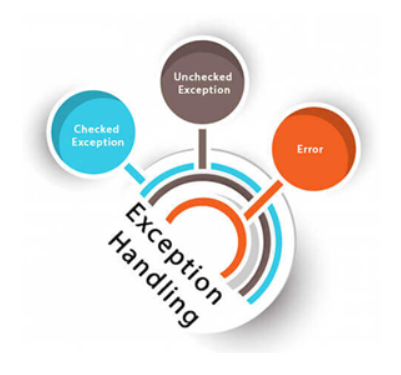

# Exceptions and debugging

<link rel="stylesheet" href="https://cdn.jsdelivr.net/npm/bootstrap@5.1.0/dist/css/bootstrap.min.css" integrity="sha384-KyZXEAg3QhqLMpG8r+8fhAXLRk2vvoC2f3B09zVXn8CA5QIVfZOJ3BCsw2P0p/We" crossorigin="anonymous">

  A simple primary alert—check it out!

Written with .NET Framework 4.8, zero advantages for this code sample to use .NET Core Framework as this is all about debugging.

## First look at the Visual Studio Debugger

[Microsoft docs](https://docs.microsoft.com/en-us/visualstudio/debugger/debugger-feature-tour?view=vs-2019)

This topic introduces the debugger tools provided by Visual Studio. In the Visual Studio context, when you debug your app, it usually means that you are running the application with the debugger attached (that is, in debugger mode). When you do this, the debugger provides many ways to see what your code is doing while it runs. You can step through your code and look at the values stored in variables, you can set watches on variables to see when values change, you can examine the execution path of your code, et al. If this is the first time that you've tried to debug code, you may want to read Debugging for absolute beginners before going through this topic.

##  Navigate through code with the Visual Studio debugger

[Microsoft docs](https://docs.microsoft.com/en-us/visualstudio/debugger/navigating-through-code-with-the-debugger?view=vs-2019)

The Visual Studio debugger can help you navigate through code to inspect the state of an app and show its execution flow. You can use keyboard shortcuts, debug commands, breakpoints, and other features to quickly get to the code you want to examine. Familiarity with debugger navigation commands and shortcuts makes it faster and easier to find and resolve app issues.

| :bulb: Note  |
| :--- |
| If this is the first time that you've tried to debug code, you may want to read [Debugging for absolute beginners](https://docs.microsoft.com/en-us/visualstudio/debugger/debugging-absolute-beginners?view=vs-2019&tabs=csharp) and [Debugging techniques and tools](https://docs.microsoft.com/en-us/visualstudio/debugger/write-better-code-with-visual-studio?view=vs-2019) before going through this article. |

